Choose a color scheme according to what color means in the plot. Categories
need distinct colors that remain easy to tell apart. Numeric values need an
ordered progression whose intermediate colors also have meaning.

The examples use the same iris PCA as the
[Getting Started](getting-started.html) article:

```r
library(vizier)

pca_iris <- stats::prcomp(iris[, -5], retx = TRUE, rank. = 2)
```

## Choose categorical or continuous behavior

Vizier derives the mapping behavior from the value supplied as `x`:

- A factor or character vector is categorical. Each observed value receives
  one color from the palette.
- A numeric vector is continuous. Values are mapped across a color ramp, so an
  ordered palette is usually the right choice.
- `colors` supplies literal per-observation colors and bypasses palette
  mapping.

For categories, the default is R's stable `"Polychrome 36"` palette when it is
available, with an HCL Dynamic fallback. Numeric values default to a sequential
HCL Viridis palette.

## Specify a palette

The `color_scheme` argument accepts:

- A function that takes an integer `n` and returns `n` colors, such as
  `grDevices::rainbow`.
- An unnamed vector of at least two colors, used as a positional palette.
- A fully named vector, used as a category-to-color mapping.
- A `paletteer` name in `"package::palette"` form, optionally followed by a
  type override such as `::c` or `::continuous`.
- The name of a built-in R palette, such as `"Okabe-Ito"` on R 4.0 or later.

### Palette functions

A palette function generates exactly the number of colors Vizier requests:

```r
embed_plot(
  pca_iris$x,
  iris$Species,
  color_scheme = grDevices::topo.colors
)
```

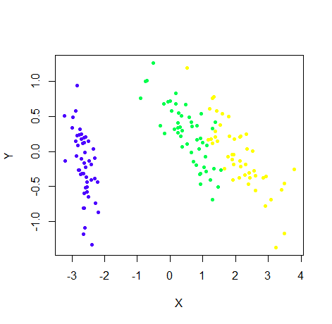

### Custom vectors and named mappings

An unnamed vector assigns colors by category position. Naming the same vector
locks each color to a category, which keeps the mapping stable after reordering
or subsetting:

```r
custom_colors <- c("black", "red", "gray")
embed_plot(pca_iris$x, iris$Species, color_scheme = custom_colors)

species_colors <- c(
  setosa = "black",
  versicolor = "red",
  virginica = "gray"
)
embed_plot(pca_iris$x, iris$Species, color_scheme = species_colors)
```

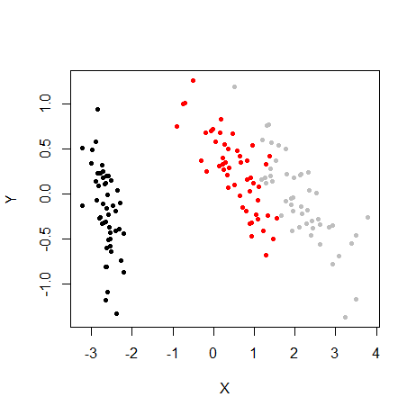

The two calls produce the same full-data plot here. For a named mapping, extra
names are ignored and every observed category must have a color.

If an unnamed vector has fewer colors than Vizier needs, Vizier interpolates
between its colors. That is appropriate only when the vector represents a
meaningful progression. Set `verbose = TRUE` to report when interpolation is
required.

### Built-in R palette names

On R 4.0 or later, pass any name returned by `grDevices::palette.pals()`:

```r
embed_plot(
  pca_iris$x,
  iris$Species,
  color_scheme = "Okabe-Ito"
)
```

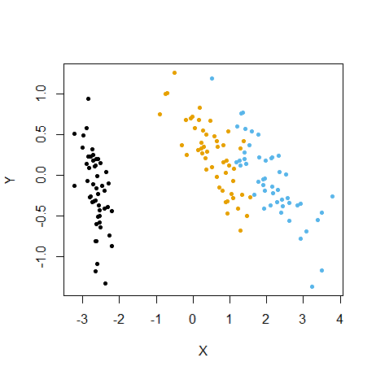

### Paletteer names

[paletteer](https://github.com/EmilHvitfeldt/paletteer) provides a common name
for palettes from many R packages. Use `"package::palette"`, for example:

```r
embed_plot(
  pca_iris$x,
  iris$Species,
  color_scheme = "RColorBrewer::Dark2"
)
```

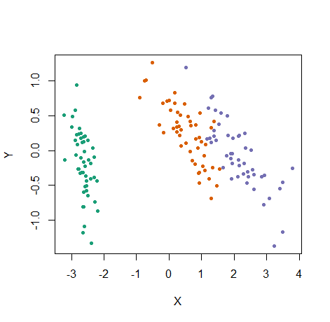

Vizier looks up whether paletteer classifies the selected palette as
continuous, fixed-width discrete, or dynamic and calls the corresponding
paletteer generator. It does not collapse those types into one behavior.

## Reverse generated colors

Set `rev = TRUE` to reverse a generated palette before Vizier maps it to
categories or numeric values:

```r
embed_plot(
  pca_iris$x,
  iris$Species,
  color_scheme = turbo
)
```

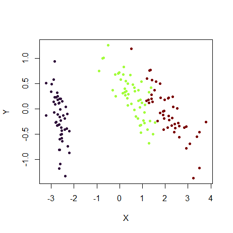

```r
embed_plot(
  pca_iris$x,
  iris$Species,
  color_scheme = turbo,
  rev = TRUE
)
```

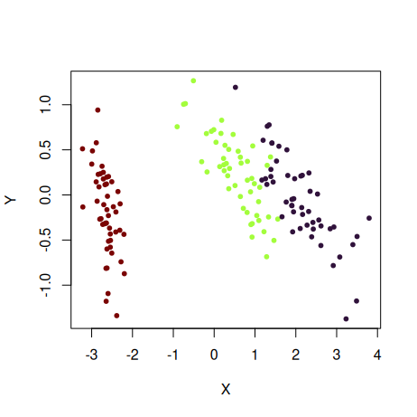

Reversal also applies to named category mappings, while preserving their names.
It does not reorder literal per-row colors supplied through `colors`.

## Sample a discrete palette across its full extent

By default, requesting three colors from a fixed-width discrete palette takes
its first three colors. Appending `::c` or `::continuous` tells paletteer to
treat that palette as continuous and sample across its full extent instead.
The explicit `::d` and `::discrete` suffixes select the default discrete
behavior.

This choice is useful only when the order and intermediate colors have a
meaningful progression.

### A qualitative palette: Dark2

The full `RColorBrewer::Dark2` palette contains unrelated qualitative colors:

```r
paletteer::paletteer_d("RColorBrewer::Dark2")
```

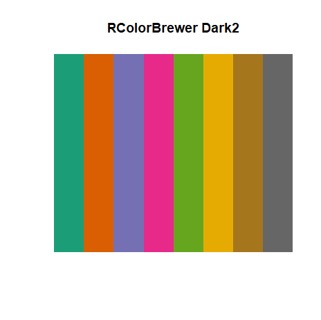

The default discrete behavior uses the first three colors:

```r
embed_plot(
  pca_iris$x,
  iris$Species,
  color_scheme = "RColorBrewer::Dark2",
  cex = 2,
  title = "RColorBrewer Dark2"
)
```

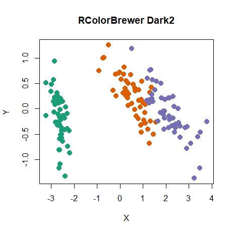

Forcing continuous sampling uses the two ends of the palette and synthesizes a
middle color between them:

```r
embed_plot(
  pca_iris$x,
  iris$Species,
  color_scheme = "RColorBrewer::Dark2::c",
  cex = 2,
  title = "RColorBrewer Dark2 (continuous)"
)
```

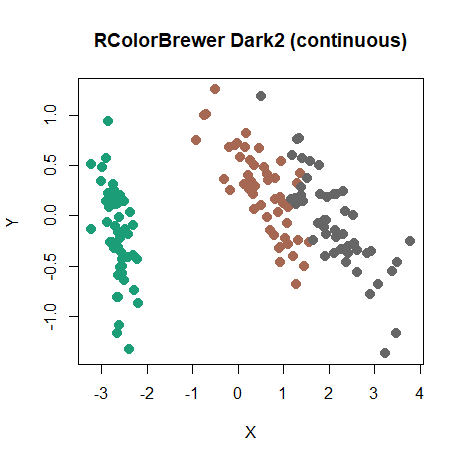

The synthesized brown is not one of Dark2's original colors and is less
distinct from the gray endpoint. Continuous sampling therefore weakens this
qualitative palette rather than improving it.

### An ordered palette: jcolors rainbow

The `jcolors::rainbow` palette has a visible red-to-purple order:

```r
paletteer::paletteer_d("jcolors::rainbow")
```

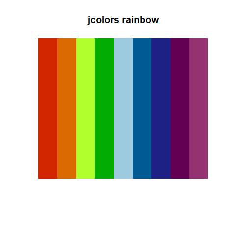

Default discrete behavior again uses the first three colors, so all three iris
species stay near the red-to-green end:

```r
embed_plot(
  pca_iris$x,
  iris$Species,
  color_scheme = "jcolors::rainbow",
  cex = 2,
  title = "jcolors rainbow"
)
```

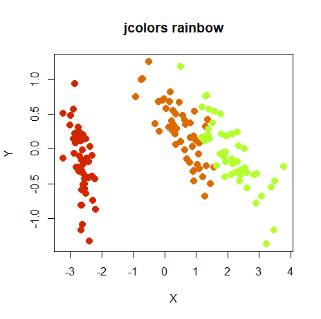

The continuous override spreads three samples across the entire ordered
palette:

```r
embed_plot(
  pca_iris$x,
  iris$Species,
  color_scheme = "jcolors::rainbow::c",
  cex = 2,
  title = "jcolors rainbow (continuous)"
)
```

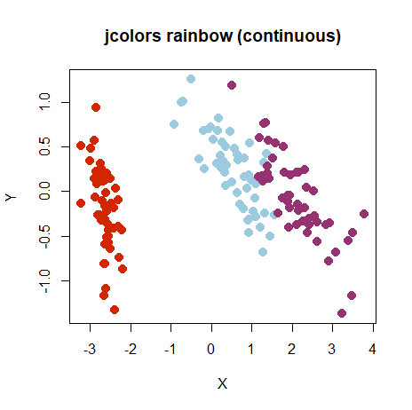

Here, sampling the full extent preserves the palette's intended order and
makes better use of its range. For unordered qualitative palettes, keep the
default discrete behavior.

<details>
<summary>Reproduce the article figures</summary>

The tracked `vignettes/articles/reproduce-figures.R` script generates every
figure in this article using the public Vizier and paletteer interfaces. It
draws the swatches with base graphics, so no swatch package is required:

```sh
Rscript --vanilla vignettes/articles/reproduce-figures.R \
  --output-dir /tmp/vizier-article-figures
```

</details>
