Vizier turns two-dimensional coordinates into a plot and handles common color
mappings for you. This guide starts with a base R plot, then shows how to color
by categories or numbers and how to switch to ggplot2 or Plotly.

## Make your first plot

Attach Vizier and create two-dimensional coordinates. Here, the coordinates are
the first two principal components of the numeric columns in `iris`:

```r
library(vizier)

pca_iris <- stats::prcomp(iris[, -5], retx = TRUE, rank. = 2)
```

Pass the coordinates and the `iris` data frame to `embed_plot()`:

```r
embed_plot(pca_iris$x, iris)
```

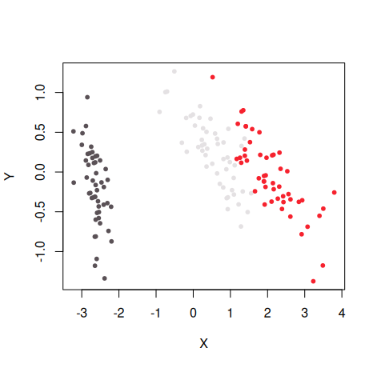

Vizier finds the factor column `Species` and gives each species a stable
categorical color. If you pass a numeric vector instead, Vizier uses a
sequential Viridis color scale. These defaults let you inspect an embedding
before choosing a palette yourself.

## Choose what color represents

Pass a factor or character vector when color should identify categories. You
can also supply a palette function and add a title and subtitle in the same
call:

```r
embed_plot(
  pca_iris$x,
  iris$Species,
  color_scheme = grDevices::rainbow,
  title = "iris PCA",
  sub = "rainbow color scheme"
)
```

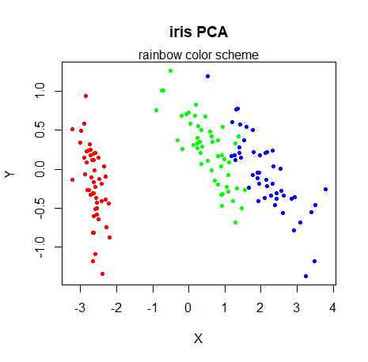

For a crowded plot, reduce opacity with `alpha_scale`:

```r
embed_plot(
  pca_iris$x,
  iris$Species,
  color_scheme = grDevices::rainbow,
  alpha_scale = 0.5
)
```

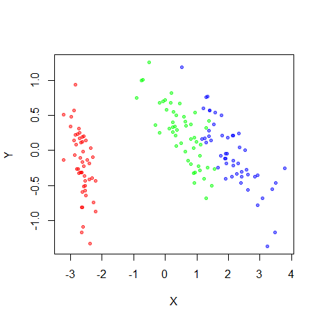

If you already have one color for each observation, pass it through `colors`.
This bypasses category and numeric mapping:

```r
my_iris_colors <- grDevices::colorRampPalette(
  c("red", "yellow")
)(nrow(iris))

embed_plot(pca_iris$x, colors = my_iris_colors)
```

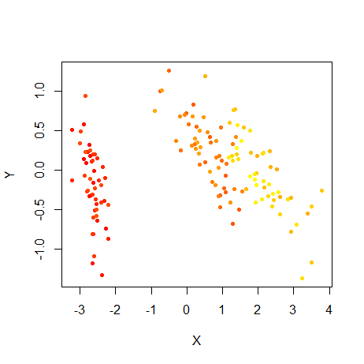

A single value such as `colors = "blue"` colors every point blue. Otherwise,
provide exactly one color per row.

Pass a numeric vector when color should show magnitude. The light-to-dark scale
below follows petal length:

```r
embed_plot(
  pca_iris$x,
  iris$Petal.Length,
  color_scheme = "RColorBrewer::Blues"
)
```

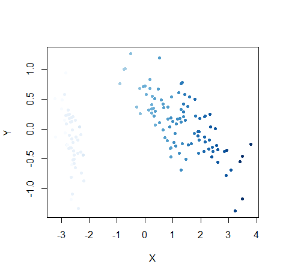

For a directly supplied numeric vector, `top` keeps only the largest finite
values. This call shows the ten observations with the longest petals:

```r
embed_plot(
  pca_iris$x,
  iris$Petal.Length,
  color_scheme = "RColorBrewer::Blues",
  top = 10
)
```

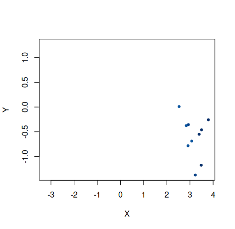

Ties are resolved by the existing row order. See the
[`embed_plot()` reference](../reference/embed_plot.html) for numeric limits,
missing-value colors, and the full selection contract.

## Adjust the coordinate display

On a non-square graphics device, unequal physical units can visually stretch a
cluster. Set `equal_axes = TRUE` to use common limits and equal units on both
axes:

```r
embed_plot(
  pca_iris$x,
  iris$Species,
  color_scheme = grDevices::topo.colors,
  equal_axes = TRUE
)
```

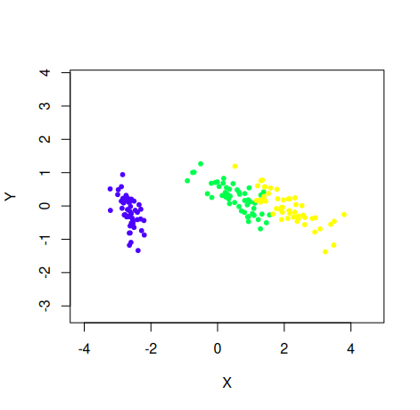

You can replace points with text. Labels work best when they are short and the
data set is small enough to avoid heavy overlap:

```r
embed_plot(
  pca_iris$x,
  iris$Species,
  text = iris$Species,
  cex = 0.75
)
```

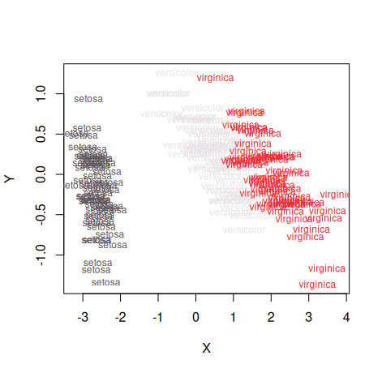

## Extend the plot with ggplot2

Install the optional
[ggplot2](https://ggplot2.tidyverse.org/) package to use `embed_ggplot()`.
It returns an ordinary ggplot object, so you can add layers, labels, and themes.
For example, add an 80% ellipse around each species:

```r
iris_ggplot <- embed_ggplot(
  pca_iris$x,
  iris$Species,
  cex = 2,
  title = "iris PCA"
)

iris_ggplot +
  ggplot2::stat_ellipse(level = 0.8, linewidth = 0.8) +
  ggplot2::labs(
    color = "Species",
    subtitle = "80% confidence ellipses"
  ) +
  ggplot2::theme_minimal(base_size = 12)
```

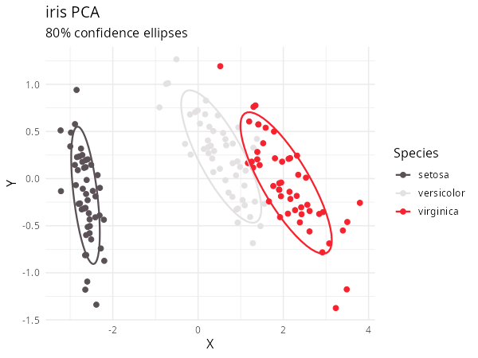

Numeric input creates a native continuous ggplot2 scale and colorbar:

```r
embed_ggplot(
  pca_iris$x,
  iris$Petal.Length,
  cex = 2,
  equal_axes = TRUE,
  title = "iris petal length"
) +
  ggplot2::labs(color = "Petal length") +
  ggplot2::theme_minimal(base_size = 12)
```

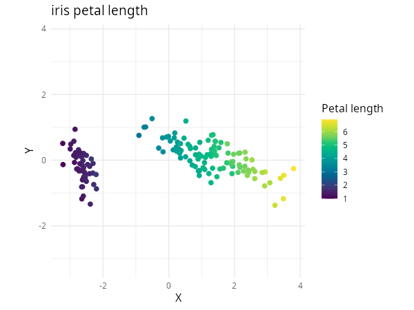

## Add interaction with Plotly

Install the optional [Plotly](https://plotly.com/r/) package to use
`embed_plotly()`. It follows the same coordinate and color conventions while
adding hover text, categorical legends, and numeric colorbars:

```r
embed_plotly(
  pca_iris$x,
  iris$Species,
  color_scheme = grDevices::rainbow
)
```

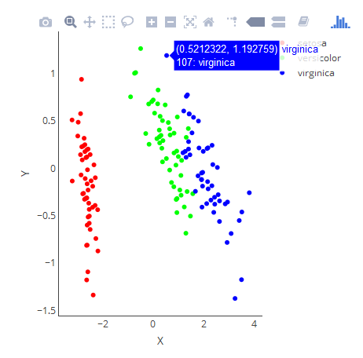

When custom tooltips carry the category information, you can hide the legend:

```r
embed_plotly(
  pca_iris$x,
  iris$Species,
  color_scheme = grDevices::rainbow,
  show_legend = FALSE,
  tooltip = paste("Species:", iris$Species)
)
```

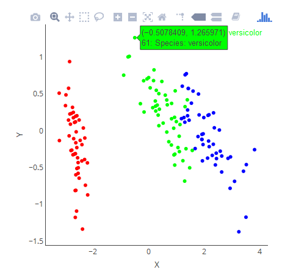

`embed_plotly()` does not have the base renderer's `top` or `sub` arguments.
Its [API reference](../reference/embed_plotly.html) documents Plotly-specific
controls such as numeric clipping and tooltips.

## Choose a different palette

Vizier accepts palette functions, custom vectors, built-in R palette names, and
the palette catalogue exposed by `paletteer`. The
[Color Schemes](color-schemes.html) article shows how to choose among them,
keep category mappings stable, reverse generated colors, and decide whether a
discrete palette should be sampled as continuous.

<details>
<summary>Reproduce the article figures</summary>

The tracked `vignettes/articles/reproduce-figures.R` script regenerates the
base and ggplot2 figures and writes the two Plotly widgets used for bounded
manual screenshots. After installing Vizier and its suggested plotting
packages, run:

```sh
Rscript --vanilla vignettes/articles/reproduce-figures.R \
  --output-dir /tmp/vizier-article-figures
```

The script prints the viewport, hover-row, and output filename for each Plotly
capture. Generate into a temporary directory and inspect the results before
replacing committed images.

</details>
